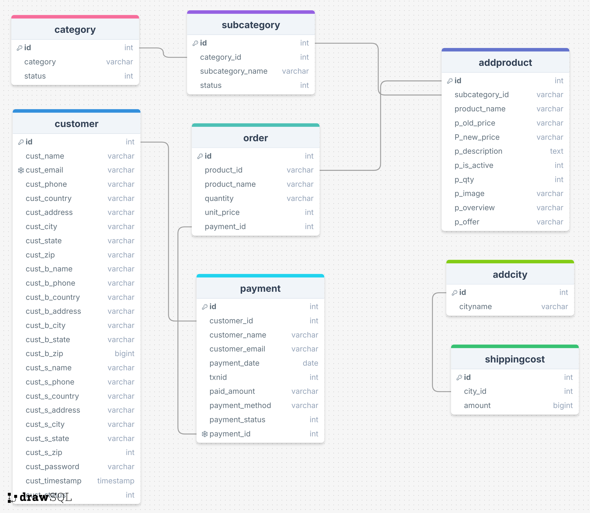

# 🛒 Ecommerce Web Application

A complete **Ecommerce Web App** built using **HTML, CSS, JavaScript, PHP, and MySQL** with a strong focus on full-stack development. This project includes customer registration, product listing, cart, payment system, order tracking, and shipping cost calculation — all powered by a well-structured relational database.

## 🧩 Project Modules

### 👤 Customer Module
- Customer registration and billing/shipping info
- Data stored in the `customer` table
- Tracks both billing and shipping addresses

### 🗂️ Category & Product Management
- `category` and `subcategory` tables for organizing products
- Products stored in `addproduct` with:
  - Old/New price
  - Quantity
  - Image and description
  - Offers and status

### 🛒 Order & Payment Management
- Orders are saved in the `order` table and linked with payments via `payment_id`
- Payment details stored in the `payment` table, including:
  - Customer info
  - Transaction ID, method, and status

### 🚚 Shipping Cost
- Shipping cost is city-based
- Cities stored in `addcity`, and linked to shipping costs via `shippingcost`

---

## 🗃️ Database Schema

> Schema includes: `category`, `subcategory`, `addproduct`, `customer`, `order`, `payment`, `addcity`, `shippingcost`

---

## 💻 Technologies Used

- **Frontend:** HTML, CSS, JavaScript
- **Backend:** PHP
- **Database:** MySQL
- **Tool:** XAMPP / WAMP for local server

---
